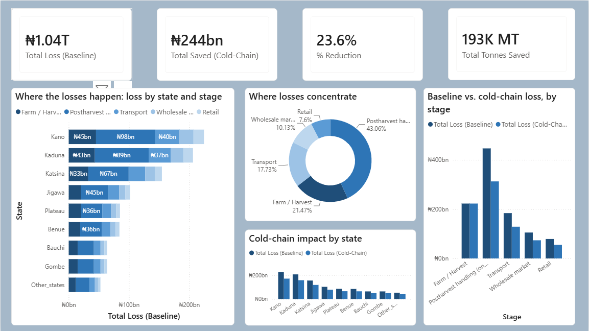

# Nigeria Tomato Post-Harvest Loss Model
### Kano to Lagos corridor case study: where the loss happens, what it costs, and what a cold-chain fix could save

Modeling Nigeria's tomato post-harvest losses and the ₦244bn/year a cold-chain fix could save — built on real 2025 NBS price data, with every assumption traced to a cited source.

## The problem

Nigeria loses an estimated 30 to 50% of its food to post-harvest loss. Tomato is the crop most
often used as a case study: it's Nigeria's highest-spoilage major crop, farmers in the northern
production belt lose over 45% of what they grow, and the resulting national supply gap runs to
roughly 500,000 metric tonnes a year against about 2.3 million tonnes of demand.

No single official Nigerian dataset breaks that down by state and by supply-chain stage in naira
terms. This project builds one, using published research and government price data, with every
assumption traced back to a source so you can see exactly what's a fact and what's an estimate.

## Scope

This model covers the belt that supplies most of Nigeria's fresh tomato: Kano, Kaduna, Katsina,
and Jigawa as the anchor producing states, plus Plateau, Benue, Gombe, and Bauchi as secondary
producers, moving toward consumption hubs like Lagos, Abuja, and Ibadan.

## Dashboard

An interactive Power BI dashboard sits on top of the model output, letting you slice loss by
state, stage, and region, and compare the baseline scenario against the cold-chain intervention.

The dashboard shows the loss breakdown by state and stage, where losses concentrate across the
supply chain, and the side-by-side baseline-vs-cold-chain comparison that produces the ₦244bn/year
savings estimate. The `.pbix` file in `dashboard/` can be opened directly in Power BI Desktop.

## What's in this repo

| File | Purpose |
|---|---|
| `data/sources.csv` | Every published figure used, with citation and URL |
| `data/state_production_estimates.csv` | State-level production split (see note below on why this is an estimate) |
| `data/stage_loss_benchmarks.csv` | Loss rate by supply-chain stage, based on a published stage-share study |
| `data/state_prices_naira_per_kg.csv` | State tomato prices, based on the 2025 NBS national average |
| `data/tomato_loss_model_output.csv` | The full calculated model, output of `scripts/model_losses.py` |
| `scripts/model_losses.py` | The Python model: computes tonnes and naira lost by state and stage, plus the cold-chain scenario |
| `scripts/build_excel.py` | Builds the Excel workbook deliverable (`docs/tomato_PHL_dataset.xlsx`) |
| `scripts/fix_widths_after_recalc.py` | Restores column widths after Excel recalculation (see note in that file) |
| `sql/schema_and_queries.sql` | SQL schema and the aggregation queries used to feed Power BI |
| `docs/tomato_PHL_dataset.xlsx` | Excel workbook: all raw tables plus a live-formula Summary tab |
| `dashboard/Tomato_phl_model.pbix` | Interactive Power BI dashboard built on the model output |
| `dashboard/dashboard_overview.png` | Screenshot of the dashboard's overview page |

## Methodology

**National loss rate.** 45%, from Cornell CALS (2023), citing Nigerian tomato value chain
reporting. Cross-checked against a broader Sub-Saharan Africa range of 30 to 50% for tomatoes.
A separate, more rigorous farm-level study (Michigan State University, Gates Foundation-funded)
found that only about 0.1% of harvested tomatoes are truly thrown away, and that most of what
gets labeled "loss" is actually sold at a reduced price rather than destroyed. That's a real
tension worth knowing about: this model still uses the 45% figure because it's the one most
consistently cited across Nigerian tomato research, but it likely overstates how much value is
completely wiped out, since a discounted sale still recovers some money. There's no published
figure for what that average discount looks like, so this model doesn't attempt to correct for
it, and the totals below should be read as an upper bound rather than a central estimate.

**Stage allocation.** A 2025 study in Scientific Reports on postharvest technology adoption in
Nigerian tomato farming gives a stage-share breakdown of total loss: 38% at production/harvest,
34% at postharvest handling, and the remaining 28% split across transport, wholesale, and retail.
I divided that 28% based on the relative sizes suggested elsewhere in the literature (transport
losing more than wholesale, which loses more than retail).

**Cross-validation.** Two separate Nigerian studies give stage-specific loss rates: 23.3% lost at
the wholesale stage, 20% lost at retail. These measure something slightly different (the percent
of volume that reaches that stage and spoils there, rather than this model's percent of the
original harvest), so they're kept in the data as a sanity check rather than folded directly into
the calculation. Both point in the same direction as the stage-share model.

**State production split.** No public dataset gives per-state tomato tonnage. I built an estimate
from the production rankings that show up repeatedly in the literature (Kano and Kaduna as the
two largest producers, then Katsina and Jigawa, and so on), applied to the national total of
roughly 2.3 million tonnes a year. This is the biggest assumption in the whole model, and it's
flagged clearly in the data.

**Prices.** This is the part that changed most during review. The model originally valued every
loss using a single June 2024 price snapshot, which turned out to be the single highest-priced
month of that year, not a representative one, which meaningfully overstated the total. It now
uses the average of the four 2025 months I could find real NBS data for (April, September,
October, and November), which came out to N1,268.90/kg nationally, both lower and far steadier
than the 2024 figures. Every other price in the table (farmgate prices for producing states,
market prices for Lagos, Abuja, and Ibadan) is scaled down from its original 2024 estimate using
the ratio between the new 2025 average and the old 2024 reference, so the relative pattern across
states is preserved even though the absolute numbers have come down. Losses further down the
chain (wholesale, retail) are still valued at the national average price rather than farmgate
price, since value has already been added by the time produce reaches those stages. That's why a
tonne lost at retail costs more than a tonne lost at the farm gate, even though fewer tonnes are
lost that far downstream.

**Cold-chain scenario.** Applies a 30% loss reduction, based on a real Nigerian study (Ohagwu et
al., 2021) that tested charcoal cooler storage bins on tomatoes. The reduction is applied to every
stage after harvest, postharvest handling, transport, wholesale, and retail, but not to the
farm/harvest stage itself, since farm-level loss is driven mainly by pests and harvest timing
rather than storage temperature.

## Key findings

Total modeled loss comes to roughly 1.04 trillion naira a year across the states covered, on
about 2.3 million tonnes of production. Postharvest handling is the single costliest stage at
around 447 billion naira, more than farm-level loss itself, because although slightly fewer
tonnes are lost there, they're worth more per kilo by that point in the chain. Kano and Kaduna
together account for roughly 42% of total loss value, in line with their outsized share of
national production. A cold-chain fix could save an estimated 244 billion naira a year, about a
quarter of total baseline loss, using an intervention that's already been field-tested rather than
a hypothetical technology.

## Limitations

This is a directional model built to fill a real gap, not an official government statistic, and it
shouldn't be cited as one. Two things stand out as the biggest sources of uncertainty:

The state production split comes from qualitative rankings in the literature, not a tonnage
census. If you find a real per-state agricultural output series (FMARD, the NAERLS Agricultural
Performance Survey, or a state Ministry of Agriculture would be the places to look), swap it into
`state_production_estimates.csv` and rerun `model_losses.py`, and everything downstream
recalculates.

The 45% national loss rate itself may overstate true economic loss, since at least one rigorous
study suggests a lot of what's labeled "loss" is actually sold at a discount rather than
destroyed outright. This model doesn't correct for that because no published figure exists for
the average discount, so treat every naira total here as a ceiling, not a best guess.

The 2025 price figure is built from four months out of twelve, since that's what I could find
real NBS reporting for. It's still a better reference than a single month, but it isn't a
complete year's average. And the stage-loss split comes from a general Nigerian horticultural
study, not one specific to tomatoes on this exact corridor, so treat it as the best available
proxy rather than a precise measurement.

## Tools used

Python (pandas) for the loss and savings model, SQLite for the aggregation layer, Excel for the
raw dataset and a live-formula summary, and Power BI for the dashboard. Power BI is built
separately from everything else here since it's desktop software: import
`data/tomato_loss_model_output.csv`, or connect Power BI to a database loaded from
`sql/schema_and_queries.sql`, to build it.
# -nigeria-tomato-postharvest-loss-analysis

